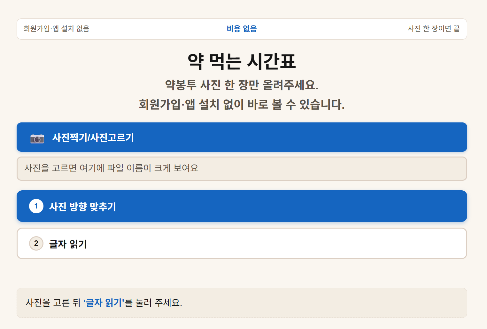

# 약 먹는 시간표

약봉투 사진 한 장만 올리면, 아침·점심·저녁·자기 전 복약 정보를 큰 글씨 시간표로 정리해 주는 서비스입니다.  
회원가입·앱 설치 없이 바로 볼 수 있습니다.



## 바로 써 보기

1. 약봉투·처방전·조제 안내문 사진을 고릅니다.
2. 필요하면 사진 방향을 맞춥니다(왼쪽/오른쪽 90° 회전).
3. **글자 읽기**를 누르면 서버에서 글자를 읽고 약 이름 초안을 보여 줍니다.
4. 보호자 확인 화면에서 약별로 복용 시간대·몇 알·언제·며칠분·비고를 확인하고, **보호자 확인 완료**를 체크합니다.
5. 결과가 큰 글씨 카드로 나오면, PNG·PDF 저장, 카드 복사, 공유 링크, 메일 앱·Gmail 발송, ICS 달력 저장 중 필요한 방식으로 저장·공유합니다.

> 사진은 저장하지 않습니다. 결과는 보호자가 확인한 내용으로만 반영됩니다.

## 핵심 기능

- **사진 업로드** — 약봉투·처방전·조제 안내문 사진 1장
- **방향 맞추기** — 사진을 좌우 90° 회전해 읽기 좋은 방향으로 보정
- **글자 읽기(서버 OCR)** — 사진을 서버로 보내 글자 추출
- **개인정보 마스킹** — 전화번호·환자명·주소 등은 초안에서 제외·비표시
- **약 이름 초안** — 추출한 텍스트에서 약 이름 후보를 뽑아 확인용으로 제시
- **보호자 확인** — 약별 시간대, 몇 알, 언제, 며칠분, 비고를 보호자가 확정
- **확정값 반영** — 자동 읽은 초안은 보호자 확인 완료 값으로 덮어씀
- **큰 글씨 시간표** — 아침·점심·저녁·자기 전·확인 메모·며칠분 카드로 표시
- **저장·공유** — 저장 범위(전체/아침/점심/저녁/자기 전/메모) 선택 후 PNG·PDF·복사·공유 링크·메일 앱·Gmail·ICS

## 저장·공유 옵션

- **PNG 저장**
- **PDF 저장**
- **카드 화면 복사**
- **공유하기**
  - 공유 링크 생성 및 복사
  - 메일 앱 열기(메일 수신자 입력 시)
  - Gmail PNG 첨부 발송(Gmail 연결 시)
  - PNG 다운로드

## 동작 방식 요약

서비스는 아래 순서로 동작합니다.

1. **입력** — 약봉투 사진 업로드, 필요 시 회전 방향 보정
2. **처리** — 서버 OCR로 글자 추출 → 개인정보 마스킹 → 약 이름 초안 추출 → 보호자 확인 입력 → 확정값 반영
3. **출력** — 큰 글씨 카드(아침/점심/저녁/자기 전/확인 메모/며칠분) + PNG·PDF·복사·공유·ICS

자세한 단계별 설명은 저장소 상단의 작성 응답(대기 중)을 참고합니다.

## 로컬에서 열어 보기

정적 파일이라 별도 빌드 없이 브라우저로 열 수 있습니다.

```bash
open medicine-schedule-largeprint/index.html
```

단, **글자 읽기·공유 링크·ICS 서버 기능**은 `/api/parse`, `/api/share`, `/api/card`, `/api/ics` 같은 백엔드가 함께 동작해야 합니다.  
로컬 파일 단독으로는 사진 업로드·방향 맞추기·결과 화면 일부까지 확인할 수 있고, OCR·공유 링크·ICS는 배포 환경에서 확인합니다.

## 기술 스택

- **프론트엔드**: HTML + CSS + JavaScript
- **이미지 캡처**: `html2canvas`
- **PDF 생성**: `jsPDF`
- **OCR 처리**: 서버 `/api/parse`에서 Upstage 문서 디지털화 API 사용
- **공유 링크/ICS**: 서버 `/api/share`, `/api/ics`

## 환경변수

서버 쪽은 아래 환경변수를 사용합니다.

- `UPSTAGE_API_KEY` — Upstage API 인증용 키(서버 사이드에서만 사용)

소스코드에는 API 키를 하드코딩하지 않습니다.  
배포 시에도 키는 환경변수로만 설정해야 하며, 정적 파일에 노출되지 않아야 합니다.

## 주의사항

- 이 서비스는 약 복용 정보를 **보기 좋게 정리**하는 도구입니다. 복약 방법·용량·안전성에 대한 의학적 판단이나 처방을 대신하지 않습니다.
- 약 이름·횟수·용법·며칠분 등은 약봉투에 적힌 내용을 바탕으로 초안이 만들어지며, 최종 확정은 보호자가 직접 확인합니다.
- 개인정보는 초안 단계에서 마스킹 처리됩니다. 사진은 서버에 저장하지 않는 것을 원칙으로 합니다.

## 프로젝트 상태

- 현재 `main` 브랜치에 정적 프론트엔드가 포함되어 있습니다.
- 배포본은 심사 종료 시까지 변경하지 않습니다.

## 기여

이슈와 개선 아이디어는 이슈로 남겨 주세요.  
큰 변경은 먼저 논의가 필요합니다.

## 라이선스

이 저장소는 별도 표기가 없으면 저장소 기본 라이선스 정책을 따릅니다.  
외부 라이브러리(html2canvas, jsPDF 등)는 각 라이브러리의 라이선스 정책을 따릅니다.

## 출처

- 외부 스킬·공공데이터 API를 그대로 가져다 쓰지 않았습니다.
- OCR 처리에는 Upstage API를 사용하며, 이는 실행 시 호출하는 외부 API 활용입니다.
- 프론트 이미지 캡처·PDF 생성에는 `html2canvas`, `jsPDF`를 CDN으로 사용합니다.
